# 伊春有事儿说 - 架构设计文档

> **项目代号**：yichun-you-shi-er-shuo
> **目标版本**：V1.0
> **文档状态**：架构设计（V1.0）
> **最后更新**：2026-06-09

---

## 0. 文档说明

本文档是 V1 版本的架构基线，所有开发任务必须以此为依据。

V1 范围（4 大模块）：
1. 房屋出租
2. 二手交易
3. 招聘求职
4. 便民信息

不在 V1 范围：IM 即时聊天、付费置顶、VIP 会员、商家 SaaS、广告引擎、小程序（V2 考虑）。

---

## 1. 产品功能分析

### 1.1 核心角色

| 角色 | 描述 | 关键行为 |
|---|---|---|
| **游客** | 未登录用户 | 浏览、搜索、查看详情 |
| **普通用户** | 已注册居民 | 发布/编辑/删除自己的信息、收藏、留言、举报 |
| **认证用户**（V1 不强制） | 完成实名认证 | 提升信任度 |
| **管理员** | 平台运营 | 审核、封禁、看板、类目管理 |

### 1.2 4 大模块功能矩阵

#### 1.2.1 房屋出租

| 子功能 | 描述 | V1 优先级 |
|---|---|---|
| 房源发布 | 标题/描述/价格/户型/图片/位置/联系方式 | P0 |
| 房源列表 | 按区域/价格/户型/整租合租筛选 | P0 |
| 房源详情 | 多图轮播、地图、配套设施、联系方式 | P0 |
| 房源搜索 | 关键词 + 区域 + 价格区间 | P0 |
| 收藏 | 用户收藏感兴趣房源 | P1 |
| 分享 | 微信/链接分享 | P1 |
| 举报 | 虚假房源举报 | P0 |
| 房源状态 | 在租/已租/下架 | P0 |
| 地图找房 | 地图上选点找房 | P2（V1 不做，V2 加） |
| 经纪人功能 | 中介专属页 | V2 |

#### 1.2.2 二手交易

| 子功能 | 描述 | V1 优先级 |
|---|---|---|
| 商品发布 | 标题/描述/价格/成色/图片/联系方式 | P0 |
| 商品列表 | 按分类/价格/成色筛选 | P0 |
| 商品详情 | 多图、描述、价格、卖家信息 | P0 |
| 搜索 | 关键词搜索 | P0 |
| 收藏 | 收藏商品 | P1 |
| 留言议价 | 买家留言、卖家回复 | P0 |
| 商品状态 | 在售/已售/下架 | P0 |
| 举报 | 举报违规商品 | P0 |
| 我买到的/我卖出的 | 订单列表（轻量，非支付）| P0 |
| 在线支付 | 担保交易 | V2 |

#### 1.2.3 招聘求职

| 子功能 | 描述 | V1 优先级 |
|---|---|---|
| 公司入驻 | 公司基本信息、Logo、营业执照（V1 不强制）| P0 |
| 职位发布 | 职位名/薪资/学历/经验/福利/描述/联系方式 | P0 |
| 职位列表 | 按行业/薪资/工作类型筛选 | P0 |
| 职位详情 | 公司介绍、职位描述、联系方式 | P0 |
| 简历创建 | 个人信息/教育/工作经历/期望职位 | P0 |
| 简历投递 | 求职者投简历到职位 | P0 |
| 收藏职位 | 求职者收藏 | P1 |
| 公司主页 | 公司的所有在招职位 | P1 |
| 求职者被查看记录 | 简历被谁看过 | P2 |
| 在线沟通 | IM | V2 |

#### 1.2.4 便民信息

| 子功能 | 描述 | V1 优先级 |
|---|---|---|
| 信息发布 | 标题/描述/分类/联系方式/有效期 | P0 |
| 信息列表 | 按子分类筛选 | P0 |
| 信息详情 | 描述、联系方式、有效期 | P0 |
| 搜索 | 关键词 | P0 |
| 子分类 | 顺风车/打听事/寻人寻物/家政/二手回收/装修/维修/教育/宠物/婚恋 等 | P0 |
| 收藏 | 收藏信息 | P1 |
| 举报 | 举报违规 | P0 |
| 过期自动下架 | 超过有效期自动失效 | P0 |

### 1.3 平台通用功能

| 功能 | 描述 | V1 优先级 |
|---|---|---|
| 手机号注册/登录 | 短信验证码 | P0 |
| 密码登录 | 备选 | P1 |
| 微信登录 | V2 | V2 |
| 用户中心 | 我的发布/我的收藏/我的消息/我的简历 | P0 |
| 站内信/留言 | 卖家/买家/求职者/招聘方之间留言 | P0 |
| 搜索（统一） | 4 大模块统一搜索入口 | P0 |
| 分类导航 | 树形分类，首页入口 | P0 |
| LBS 按区域 | 选区域（伊春市 + 各区县 + 街道）| P0 |
| 数据统计 | 浏览量、收藏量、留言量 | P0 |
| 内容审核 | 发布后进入审核流 | P0 |
| 举报处理 | 举报后管理员处理 | P0 |
| 管理后台 | 内容管理、用户管理、类目管理、看板 | P0 |

### 1.4 非功能需求

| 维度 | 要求 |
|---|---|
| 性能 | 列表页 LCP < 2.5s，搜索 < 1s |
| SEO | 列表/详情页 SSR，关键字友好 URL |
| 移动端 | 优先移动端 H5，PC 适配 |
| 兼容性 | iOS Safari 14+、Android Chrome 80+、微信内置浏览器 |
| 安全 | XSS、SQL 注入、CSRF 防护、密码 bcrypt |
| 数据 | MySQL 主从（V1 单机）、Redis 缓存热门列表 |
| 监控 | Sentry 错误上报（V1.1 加） |
| 合规 | 内容审核、个人信息保护（不收集身份证号） |

---

## 2. 数据库 ER 图

### 2.1 核心实体关系（Mermaid）

```mermaid
erDiagram
    USER ||--o{ POST : "发布"
    USER ||--o{ FAVORITE : "收藏"
    USER ||--o{ COMMENT : "留言"
    USER ||--o{ REPORT : "举报"
    USER ||--o{ MESSAGE : "收发"
    USER ||--o{ RESUME : "拥有"
    USER ||--o{ VIEW_LOG : "浏览"
    USER ||--o{ LOGIN_LOG : "登录"

    CATEGORY ||--o{ POST : "归类"
    CATEGORY ||--o{ CATEGORY : "父子"

    AREA ||--o{ POST : "所属区域"
    AREA ||--o{ AREA : "父子"

    POST ||--|| POST_HOUSE : "1:1 房屋详情"
    POST ||--|| POST_SECONDHAND : "1:1 二手详情"
    POST ||--|| POST_JOB : "1:1 招聘详情"
    POST ||--|| POST_LIFEBIZ : "1:1 便民详情"

    POST ||--o{ POST_IMAGE : "图片"
    POST ||--o{ FAVORITE : "被收藏"
    POST ||--o{ COMMENT : "被留言"
    POST ||--o{ REPORT : "被举报"
    POST ||--o{ VIEW_LOG : "被浏览"
    POST ||--o{ AUDIT_LOG : "审核历史"

    COMPANY ||--o{ POST_JOB : "发布职位"
    COMPANY ||--|| USER : "创建者"

    POST_JOB ||--o{ JOB_APPLICATION : "收到投递"
    RESUME ||--o{ JOB_APPLICATION : "发起投递"

    USER {
        bigint id PK
        varchar phone UK "手机号"
        varchar password "bcrypt"
        varchar nickname
        varchar avatar
        tinyint gender "0未知 1男 2女"
        tinyint status "0正常 1封禁"
        datetime created_at
        datetime updated_at
    }

    POST {
        bigint id PK
        bigint user_id FK
        bigint category_id FK
        bigint area_id FK
        varchar type "house/secondhand/job/lifebiz"
        varchar title
        text description
        decimal price
        varchar price_unit "元/月 元/件 元/天 面议"
        varchar contact_name
        varchar contact_phone
        varchar contact_wechat
        varchar status "draft/pending/active/sold/expired/deleted/rejected"
        varchar audit_status "pending/passed/rejected"
        int view_count
        int favorite_count
        int comment_count
        tinyint is_top "是否置顶 V1不用"
        datetime top_expire_at
        datetime expired_at "过期时间"
        datetime created_at
        datetime updated_at
    }

    CATEGORY {
        bigint id PK
        bigint parent_id FK
        varchar name
        varchar code "house/secondhand/job/lifebiz"
        varchar icon
        int sort_order
        tinyint status "0禁用 1启用"
    }

    AREA {
        bigint id PK
        bigint parent_id FK
        varchar name "伊春市/伊美区/南岔县/..."
        int level "1市 2区县 3街道"
        varchar ad_code "行政区划码"
    }

    POST_HOUSE {
        bigint id PK
        bigint post_id FK,UK
        varchar rental_type "整租/合租/短租"
        varchar property_type "小区/公寓/民房/商铺"
        varchar decoration "精装/简装/毛坯"
        decimal area_sqm "面积㎡"
        tinyint rooms "几室"
        tinyint living_rooms "几厅"
        tinyint bathrooms "几卫"
        varchar floor_info "如 5/18层"
        varchar orientation "南北通透/朝南/..."
        int building_year
        varchar community_name "小区名"
        varchar address
        decimal longitude
        decimal latitude
        varchar facilities "JSON: 空调/洗衣机/..."
    }

    POST_SECONDHAND {
        bigint id PK
        bigint post_id FK,UK
        varchar category_name "数码/家电/服饰/书籍/..."
        varchar condition "全新/9成新/8成新/..."
        decimal original_price
        varchar trade_method "同城自提/包邮/均可"
        varchar usage_duration "用了多久"
    }

    POST_JOB {
        bigint id PK
        bigint post_id FK,UK
        bigint company_id FK
        varchar job_type "全职/兼职/实习"
        decimal salary_min
        decimal salary_max
        varchar salary_unit "元/月 元/天 元/时"
        varchar education "不限/高中/大专/本科/硕士"
        varchar experience "不限/1-3年/3-5年/5-10年"
        varchar industry "行业"
        varchar welfare "JSON数组"
        int recruit_count "招聘人数"
        varchar work_city
        varchar work_address
    }

    POST_LIFEBIZ {
        bigint id PK
        bigint post_id FK,UK
        varchar sub_category "顺风车/打听事/家政/..."
        varchar service_type "提供/需求"
        decimal price "面议填0"
        varchar price_text "如 50元/次"
        varchar validity_period "一天/一周/一个月/长期"
        datetime expire_at "计算后的过期时间"
    }

    POST_IMAGE {
        bigint id PK
        bigint post_id FK
        varchar url
        int sort_order
        tinyint is_cover
    }

    COMPANY {
        bigint id PK
        bigint creator_user_id FK
        varchar name
        varchar logo
        varchar industry
        varchar scale "1-20人/20-99人/..."
        varchar nature "民营/国企/..."
        varchar address
        varchar description
        tinyint verified "0未认证 1已认证"
    }

    RESUME {
        bigint id PK
        bigint user_id FK,UK
        varchar name
        tinyint gender
        int age
        varchar phone
        varchar email
        varchar education
        varchar experience
        varchar expected_position
        decimal expected_salary
        varchar expected_city
        text self_intro
        tinyint is_public "0仅自己 1公开"
    }

    JOB_APPLICATION {
        bigint id PK
        bigint post_job_id FK
        bigint resume_id FK
        bigint user_id FK
        text cover_letter
        varchar status "已投递/已查看/已回复"
        datetime created_at
    }

    FAVORITE {
        bigint id PK
        bigint user_id FK
        bigint post_id FK
        datetime created_at
    }

    COMMENT {
        bigint id PK
        bigint user_id FK
        bigint post_id FK
        bigint parent_id FK "留言回复"
        text content
        tinyint status "0正常 1隐藏"
        datetime created_at
    }

    REPORT {
        bigint id PK
        bigint user_id FK
        bigint post_id FK
        varchar reason "虚假/违法/重复/..."
        text description
        varchar status "pending/handled/ignored"
        datetime created_at
    }

    MESSAGE {
        bigint id PK
        bigint from_user_id FK
        bigint to_user_id FK
        bigint post_id FK "可选，关联某个信息"
        text content
        tinyint is_read
        datetime read_at
        datetime created_at
    }

    VIEW_LOG {
        bigint id PK
        bigint user_id FK "可空，游客为null"
        bigint post_id FK
        varchar ip
        datetime created_at
    }

    AUDIT_LOG {
        bigint id PK
        bigint post_id FK
        bigint admin_user_id FK
        varchar action "pass/reject"
        text reason
        datetime created_at
    }

    LOGIN_LOG {
        bigint id PK
        bigint user_id FK
        varchar ip
        varchar device
        datetime created_at
    }
```



### 2.2 关键设计决策

| 决策点 | 选择 | 理由 |
|---|---|---|
| 4 类信息存储 | **统一 posts 表 + 4 张详情表**（1:1）| 列表/搜索用统一接口，详情各自扩展字段；比 4 套独立表维护成本低 |
| 图片存储 | **独立 post_images 表 + OSS 路径** | 一对多、支持多图、CDN 加速 |
| 分类 | **树形 + 顶级 code 关联模块** | 支持多级分类，顶级 code 关联 4 大模块 |
| 区域 | **树形 + 行政区划码** | 支持伊春市 + 区县 + 街道 |
| 审核流 | **audit_status 字段 + audit_log 表** | 简单清晰，保留历史 |
| 价格字段 | **decimal(10,2)** | 避免浮点问题 |
| 软删除 | **status 字段 deleted** | 不真删，保留数据 |
| 时间字段 | **datetime + UTC+8 写库** | 统一时区 |

---

## 3. MySQL 表设计

> **命名规范**：
> - 表名：`snake_case` + 业务前缀
> - 主键：`id`（bigint 自增）
> - 时间字段：`created_at`、`updated_at`
> - 软删字段：`status` 枚举（含 `deleted`）
> - 索引：`_idx` 后缀；唯一索引 `_uk` 后缀

### 3.1 通用表

#### 3.1.1 `users` 用户表

```sql
CREATE TABLE `users` (
  `id` BIGINT UNSIGNED NOT NULL AUTO_INCREMENT,
  `phone` VARCHAR(20) NOT NULL COMMENT '手机号',
  `password` VARCHAR(100) DEFAULT NULL COMMENT 'bcrypt 密码，可空（仅验证码登录）',
  `nickname` VARCHAR(50) NOT NULL DEFAULT '' COMMENT '昵称',
  `avatar` VARCHAR(255) DEFAULT NULL COMMENT '头像 URL',
  `gender` TINYINT NOT NULL DEFAULT 0 COMMENT '0未知 1男 2女',
  `bio` VARCHAR(255) DEFAULT NULL COMMENT '简介',
  `status` TINYINT NOT NULL DEFAULT 0 COMMENT '0正常 1封禁',
  `last_login_at` DATETIME DEFAULT NULL,
  `created_at` DATETIME NOT NULL DEFAULT CURRENT_TIMESTAMP,
  `updated_at` DATETIME NOT NULL DEFAULT CURRENT_TIMESTAMP ON UPDATE CURRENT_TIMESTAMP,
  PRIMARY KEY (`id`),
  UNIQUE KEY `uk_phone` (`phone`),
  KEY `idx_status_created` (`status`, `created_at`)
) ENGINE=InnoDB DEFAULT CHARSET=utf8mb4 COLLATE=utf8mb4_unicode_ci COMMENT='用户表';
```

#### 3.1.2 `categories` 分类表

```sql
CREATE TABLE `categories` (
  `id` BIGINT UNSIGNED NOT NULL AUTO_INCREMENT,
  `parent_id` BIGINT UNSIGNED NOT NULL DEFAULT 0 COMMENT '父分类 id，0=顶级',
  `code` VARCHAR(30) NOT NULL COMMENT 'house/secondhand/job/lifebiz，顶级分类用',
  `name` VARCHAR(50) NOT NULL COMMENT '分类名',
  `icon` VARCHAR(255) DEFAULT NULL COMMENT '图标 URL',
  `sort_order` INT NOT NULL DEFAULT 0,
  `status` TINYINT NOT NULL DEFAULT 1 COMMENT '0禁用 1启用',
  `created_at` DATETIME NOT NULL DEFAULT CURRENT_TIMESTAMP,
  `updated_at` DATETIME NOT NULL DEFAULT CURRENT_TIMESTAMP ON UPDATE CURRENT_TIMESTAMP,
  PRIMARY KEY (`id`),
  KEY `idx_parent_sort` (`parent_id`, `sort_order`),
  KEY `idx_code` (`code`)
) ENGINE=InnoDB DEFAULT CHARSET=utf8mb4 COMMENT='分类表（树形）';
```

#### 3.1.3 `areas` 区域表

```sql
CREATE TABLE `areas` (
  `id` BIGINT UNSIGNED NOT NULL AUTO_INCREMENT,
  `parent_id` BIGINT UNSIGNED NOT NULL DEFAULT 0,
  `name` VARCHAR(50) NOT NULL,
  `level` TINYINT NOT NULL COMMENT '1市 2区县 3街道',
  `ad_code` VARCHAR(20) DEFAULT NULL COMMENT '行政区划码',
  `sort_order` INT NOT NULL DEFAULT 0,
  `created_at` DATETIME NOT NULL DEFAULT CURRENT_TIMESTAMP,
  PRIMARY KEY (`id`),
  KEY `idx_parent` (`parent_id`),
  KEY `idx_adcode` (`ad_code`)
) ENGINE=InnoDB DEFAULT CHARSET=utf8mb4 COMMENT='区域表';
```

### 3.2 核心业务表

#### 3.2.1 `posts` 信息主表

```sql
CREATE TABLE `posts` (
  `id` BIGINT UNSIGNED NOT NULL AUTO_INCREMENT,
  `user_id` BIGINT UNSIGNED NOT NULL,
  `category_id` BIGINT UNSIGNED NOT NULL,
  `area_id` BIGINT UNSIGNED DEFAULT NULL,
  `type` VARCHAR(20) NOT NULL COMMENT 'house/secondhand/job/lifebiz',
  `title` VARCHAR(100) NOT NULL,
  `description` TEXT NOT NULL,
  `price` DECIMAL(10,2) DEFAULT 0 COMMENT '0=面议',
  `price_unit` VARCHAR(20) DEFAULT NULL COMMENT '元/月 元/件 元/天',
  `contact_name` VARCHAR(50) DEFAULT NULL,
  `contact_phone` VARCHAR(20) DEFAULT NULL,
  `contact_wechat` VARCHAR(50) DEFAULT NULL,
  `status` VARCHAR(20) NOT NULL DEFAULT 'draft' COMMENT 'draft/pending/active/sold/expired/deleted/rejected',
  `audit_status` VARCHAR(20) NOT NULL DEFAULT 'pending' COMMENT 'pending/passed/rejected',
  `audit_reason` VARCHAR(255) DEFAULT NULL,
  `view_count` INT NOT NULL DEFAULT 0,
  `favorite_count` INT NOT NULL DEFAULT 0,
  `comment_count` INT NOT NULL DEFAULT 0,
  `expired_at` DATETIME DEFAULT NULL COMMENT '过期时间，便民信息用',
  `created_at` DATETIME NOT NULL DEFAULT CURRENT_TIMESTAMP,
  `updated_at` DATETIME NOT NULL DEFAULT CURRENT_TIMESTAMP ON UPDATE CURRENT_TIMESTAMP,
  PRIMARY KEY (`id`),
  KEY `idx_user` (`user_id`),
  KEY `idx_category_status` (`category_id`, `status`, `created_at`),
  KEY `idx_area_status` (`area_id`, `status`, `created_at`),
  KEY `idx_type_status_created` (`type`, `status`, `created_at`),
  KEY `idx_audit_status` (`audit_status`, `created_at`),
  KEY `idx_title` (`title`) /* 全文索引见下 */
) ENGINE=InnoDB DEFAULT CHARSET=utf8mb4 COMMENT='信息主表（4大模块共用）';

-- 全文索引（V1 用 MySQL 全文，V2 升级 ES）
ALTER TABLE `posts` ADD FULLTEXT INDEX `ft_title_desc` (`title`, `description`) WITH PARSER ngram;
```

#### 3.2.2 `post_houses` 房屋详情

```sql
CREATE TABLE `post_houses` (
  `id` BIGINT UNSIGNED NOT NULL AUTO_INCREMENT,
  `post_id` BIGINT UNSIGNED NOT NULL,
  `rental_type` VARCHAR(20) NOT NULL COMMENT '整租/合租/短租',
  `property_type` VARCHAR(20) NOT NULL COMMENT '小区/公寓/民房/商铺',
  `decoration` VARCHAR(20) DEFAULT NULL,
  `area_sqm` DECIMAL(8,2) DEFAULT NULL,
  `rooms` TINYINT DEFAULT NULL,
  `living_rooms` TINYINT DEFAULT NULL,
  `bathrooms` TINYINT DEFAULT NULL,
  `floor_info` VARCHAR(50) DEFAULT NULL,
  `orientation` VARCHAR(50) DEFAULT NULL,
  `building_year` INT DEFAULT NULL,
  `community_name` VARCHAR(100) DEFAULT NULL,
  `address` VARCHAR(255) DEFAULT NULL,
  `longitude` DECIMAL(10,6) DEFAULT NULL,
  `latitude` DECIMAL(10,6) DEFAULT NULL,
  `facilities` JSON DEFAULT NULL COMMENT '空调/洗衣机/...',
  PRIMARY KEY (`id`),
  UNIQUE KEY `uk_post` (`post_id`)
) ENGINE=InnoDB DEFAULT CHARSET=utf8mb4 COMMENT='房屋详情';
```

#### 3.2.3 `post_secondhands` 二手详情

```sql
CREATE TABLE `post_secondhands` (
  `id` BIGINT UNSIGNED NOT NULL AUTO_INCREMENT,
  `post_id` BIGINT UNSIGNED NOT NULL,
  `category_name` VARCHAR(50) NOT NULL COMMENT '数码/家电/...',
  `condition` VARCHAR(20) NOT NULL COMMENT '全新/9成新/...',
  `original_price` DECIMAL(10,2) DEFAULT NULL,
  `trade_method` VARCHAR(30) DEFAULT '同城自提',
  `usage_duration` VARCHAR(50) DEFAULT NULL,
  PRIMARY KEY (`id`),
  UNIQUE KEY `uk_post` (`post_id`),
  KEY `idx_category` (`category_name`)
) ENGINE=InnoDB DEFAULT CHARSET=utf8mb4 COMMENT='二手详情';
```

#### 3.2.4 `post_jobs` 招聘详情 + companies 公司

```sql
CREATE TABLE `companies` (
  `id` BIGINT UNSIGNED NOT NULL AUTO_INCREMENT,
  `creator_user_id` BIGINT UNSIGNED NOT NULL,
  `name` VARCHAR(100) NOT NULL,
  `logo` VARCHAR(255) DEFAULT NULL,
  `industry` VARCHAR(50) DEFAULT NULL,
  `scale` VARCHAR(30) DEFAULT NULL,
  `nature` VARCHAR(30) DEFAULT NULL,
  `address` VARCHAR(255) DEFAULT NULL,
  `description` TEXT,
  `verified` TINYINT NOT NULL DEFAULT 0,
  `created_at` DATETIME NOT NULL DEFAULT CURRENT_TIMESTAMP,
  `updated_at` DATETIME NOT NULL DEFAULT CURRENT_TIMESTAMP ON UPDATE CURRENT_TIMESTAMP,
  PRIMARY KEY (`id`),
  KEY `idx_creator` (`creator_user_id`),
  KEY `idx_name` (`name`)
) ENGINE=InnoDB DEFAULT CHARSET=utf8mb4 COMMENT='公司表';

CREATE TABLE `post_jobs` (
  `id` BIGINT UNSIGNED NOT NULL AUTO_INCREMENT,
  `post_id` BIGINT UNSIGNED NOT NULL,
  `company_id` BIGINT UNSIGNED NOT NULL,
  `job_type` VARCHAR(20) NOT NULL,
  `salary_min` DECIMAL(10,2) DEFAULT NULL,
  `salary_max` DECIMAL(10,2) DEFAULT NULL,
  `salary_unit` VARCHAR(20) DEFAULT '元/月',
  `education` VARCHAR(20) DEFAULT '不限',
  `experience` VARCHAR(20) DEFAULT '不限',
  `industry` VARCHAR(50) DEFAULT NULL,
  `welfare` JSON DEFAULT NULL,
  `recruit_count` INT NOT NULL DEFAULT 1,
  `work_city` VARCHAR(50) DEFAULT '伊春',
  `work_address` VARCHAR(255) DEFAULT NULL,
  PRIMARY KEY (`id`),
  UNIQUE KEY `uk_post` (`post_id`),
  KEY `idx_company` (`company_id`),
  KEY `idx_salary` (`salary_min`, `salary_max`)
) ENGINE=InnoDB DEFAULT CHARSET=utf8mb4 COMMENT='招聘详情';
```

#### 3.2.5 `post_lifebizs` 便民详情

```sql
CREATE TABLE `post_lifebizs` (
  `id` BIGINT UNSIGNED NOT NULL AUTO_INCREMENT,
  `post_id` BIGINT UNSIGNED NOT NULL,
  `sub_category` VARCHAR(50) NOT NULL COMMENT '顺风车/打听事/...',
  `service_type` VARCHAR(20) DEFAULT '提供' COMMENT '提供/需求',
  `price` DECIMAL(10,2) DEFAULT 0,
  `price_text` VARCHAR(50) DEFAULT NULL,
  `validity_period` VARCHAR(20) DEFAULT '一个月',
  `expire_at` DATETIME DEFAULT NULL,
  PRIMARY KEY (`id`),
  UNIQUE KEY `uk_post` (`post_id`),
  KEY `idx_sub` (`sub_category`)
) ENGINE=InnoDB DEFAULT CHARSET=utf8mb4 COMMENT='便民详情';
```

#### 3.2.6 `post_images` 信息图片

```sql
CREATE TABLE `post_images` (
  `id` BIGINT UNSIGNED NOT NULL AUTO_INCREMENT,
  `post_id` BIGINT UNSIGNED NOT NULL,
  `url` VARCHAR(500) NOT NULL,
  `sort_order` INT NOT NULL DEFAULT 0,
  `is_cover` TINYINT NOT NULL DEFAULT 0,
  `created_at` DATETIME NOT NULL DEFAULT CURRENT_TIMESTAMP,
  PRIMARY KEY (`id`),
  KEY `idx_post` (`post_id`, `sort_order`)
) ENGINE=InnoDB DEFAULT CHARSET=utf8mb4 COMMENT='信息图片';
```

### 3.3 互动表

#### 3.3.1 `favorites` 收藏

```sql
CREATE TABLE `favorites` (
  `id` BIGINT UNSIGNED NOT NULL AUTO_INCREMENT,
  `user_id` BIGINT UNSIGNED NOT NULL,
  `post_id` BIGINT UNSIGNED NOT NULL,
  `created_at` DATETIME NOT NULL DEFAULT CURRENT_TIMESTAMP,
  PRIMARY KEY (`id`),
  UNIQUE KEY `uk_user_post` (`user_id`, `post_id`),
  KEY `idx_user_created` (`user_id`, `created_at`)
) ENGINE=InnoDB DEFAULT CHARSET=utf8mb4 COMMENT='收藏';
```

#### 3.3.2 `comments` 留言/评论

```sql
CREATE TABLE `comments` (
  `id` BIGINT UNSIGNED NOT NULL AUTO_INCREMENT,
  `user_id` BIGINT UNSIGNED NOT NULL,
  `post_id` BIGINT UNSIGNED NOT NULL,
  `parent_id` BIGINT UNSIGNED NOT NULL DEFAULT 0 COMMENT '0=顶级',
  `content` VARCHAR(500) NOT NULL,
  `status` TINYINT NOT NULL DEFAULT 0 COMMENT '0正常 1隐藏',
  `created_at` DATETIME NOT NULL DEFAULT CURRENT_TIMESTAMP,
  PRIMARY KEY (`id`),
  KEY `idx_post_created` (`post_id`, `created_at`),
  KEY `idx_user` (`user_id`)
) ENGINE=InnoDB DEFAULT CHARSET=utf8mb4 COMMENT='留言/评论';
```

#### 3.3.3 `reports` 举报

```sql
CREATE TABLE `reports` (
  `id` BIGINT UNSIGNED NOT NULL AUTO_INCREMENT,
  `user_id` BIGINT UNSIGNED NOT NULL,
  `post_id` BIGINT UNSIGNED NOT NULL,
  `reason` VARCHAR(50) NOT NULL COMMENT '虚假信息/违法/重复/...',
  `description` VARCHAR(500) DEFAULT NULL,
  `status` VARCHAR(20) NOT NULL DEFAULT 'pending' COMMENT 'pending/handled/ignored',
  `handled_by` BIGINT UNSIGNED DEFAULT NULL,
  `handled_at` DATETIME DEFAULT NULL,
  `created_at` DATETIME NOT NULL DEFAULT CURRENT_TIMESTAMP,
  PRIMARY KEY (`id`),
  KEY `idx_post` (`post_id`),
  KEY `idx_status_created` (`status`, `created_at`)
) ENGINE=InnoDB DEFAULT CHARSET=utf8mb4 COMMENT='举报';
```

#### 3.3.4 `messages` 站内信

```sql
CREATE TABLE `messages` (
  `id` BIGINT UNSIGNED NOT NULL AUTO_INCREMENT,
  `from_user_id` BIGINT UNSIGNED NOT NULL,
  `to_user_id` BIGINT UNSIGNED NOT NULL,
  `post_id` BIGINT UNSIGNED DEFAULT NULL COMMENT '关联信息',
  `content` VARCHAR(1000) NOT NULL,
  `is_read` TINYINT NOT NULL DEFAULT 0,
  `read_at` DATETIME DEFAULT NULL,
  `created_at` DATETIME NOT NULL DEFAULT CURRENT_TIMESTAMP,
  PRIMARY KEY (`id`),
  KEY `idx_to_read_created` (`to_user_id`, `is_read`, `created_at`),
  KEY `idx_from_created` (`from_user_id`, `created_at`)
) ENGINE=InnoDB DEFAULT CHARSET=utf8mb4 COMMENT='站内信';
```

### 3.4 用户扩展表

#### 3.4.1 `resumes` 简历

```sql
CREATE TABLE `resumes` (
  `id` BIGINT UNSIGNED NOT NULL AUTO_INCREMENT,
  `user_id` BIGINT UNSIGNED NOT NULL,
  `name` VARCHAR(50) NOT NULL,
  `gender` TINYINT DEFAULT 0,
  `age` INT DEFAULT NULL,
  `phone` VARCHAR(20) DEFAULT NULL,
  `email` VARCHAR(100) DEFAULT NULL,
  `education` VARCHAR(20) DEFAULT NULL,
  `experience` VARCHAR(20) DEFAULT NULL,
  `expected_position` VARCHAR(100) DEFAULT NULL,
  `expected_salary` DECIMAL(10,2) DEFAULT NULL,
  `expected_city` VARCHAR(50) DEFAULT '伊春',
  `self_intro` TEXT,
  `is_public` TINYINT NOT NULL DEFAULT 0,
  `created_at` DATETIME NOT NULL DEFAULT CURRENT_TIMESTAMP,
  `updated_at` DATETIME NOT NULL DEFAULT CURRENT_TIMESTAMP ON UPDATE CURRENT_TIMESTAMP,
  PRIMARY KEY (`id`),
  UNIQUE KEY `uk_user` (`user_id`)
) ENGINE=InnoDB DEFAULT CHARSET=utf8mb4 COMMENT='简历';
```

#### 3.4.2 `job_applications` 投递记录

```sql
CREATE TABLE `job_applications` (
  `id` BIGINT UNSIGNED NOT NULL AUTO_INCREMENT,
  `post_job_id` BIGINT UNSIGNED NOT NULL,
  `resume_id` BIGINT UNSIGNED NOT NULL,
  `user_id` BIGINT UNSIGNED NOT NULL,
  `cover_letter` VARCHAR(500) DEFAULT NULL,
  `status` VARCHAR(20) NOT NULL DEFAULT '已投递',
  `created_at` DATETIME NOT NULL DEFAULT CURRENT_TIMESTAMP,
  `updated_at` DATETIME NOT NULL DEFAULT CURRENT_TIMESTAMP ON UPDATE CURRENT_TIMESTAMP,
  PRIMARY KEY (`id`),
  UNIQUE KEY `uk_job_resume` (`post_job_id`, `resume_id`),
  KEY `idx_user_created` (`user_id`, `created_at`)
) ENGINE=InnoDB DEFAULT CHARSET=utf8mb4 COMMENT='投递记录';
```

### 3.5 日志表

#### 3.5.1 `view_logs` 浏览日志

```sql
CREATE TABLE `view_logs` (
  `id` BIGINT UNSIGNED NOT NULL AUTO_INCREMENT,
  `user_id` BIGINT UNSIGNED DEFAULT NULL,
  `post_id` BIGINT UNSIGNED NOT NULL,
  `ip` VARCHAR(45) DEFAULT NULL,
  `created_at` DATETIME NOT NULL DEFAULT CURRENT_TIMESTAMP,
  PRIMARY KEY (`id`),
  KEY `idx_post_created` (`post_id`, `created_at`),
  KEY `idx_user_created` (`user_id`, `created_at`)
) ENGINE=InnoDB DEFAULT CHARSET=utf8mb4 COMMENT='浏览日志';
```

#### 3.5.2 `audit_logs` 审核日志

```sql
CREATE TABLE `audit_logs` (
  `id` BIGINT UNSIGNED NOT NULL AUTO_INCREMENT,
  `post_id` BIGINT UNSIGNED NOT NULL,
  `admin_user_id` BIGINT UNSIGNED NOT NULL,
  `action` VARCHAR(20) NOT NULL,
  `reason` VARCHAR(255) DEFAULT NULL,
  `created_at` DATETIME NOT NULL DEFAULT CURRENT_TIMESTAMP,
  PRIMARY KEY (`id`),
  KEY `idx_post` (`post_id`),
  KEY `idx_admin_created` (`admin_user_id`, `created_at`)
) ENGINE=InnoDB DEFAULT CHARSET=utf8mb4 COMMENT='审核日志';
```

#### 3.5.3 `login_logs` 登录日志

```sql
CREATE TABLE `login_logs` (
  `id` BIGINT UNSIGNED NOT NULL AUTO_INCREMENT,
  `user_id` BIGINT UNSIGNED NOT NULL,
  `ip` VARCHAR(45) DEFAULT NULL,
  `device` VARCHAR(255) DEFAULT NULL,
  `created_at` DATETIME NOT NULL DEFAULT CURRENT_TIMESTAMP,
  PRIMARY KEY (`id`),
  KEY `idx_user_created` (`user_id`, `created_at`)
) ENGINE=InnoDB DEFAULT CHARSET=utf8mb4 COMMENT='登录日志';
```

### 3.6 索引策略

| 表 | 关键索引 | 用途 |
|---|---|---|
| posts | `idx_type_status_created`、`idx_category_status`、`idx_area_status` | 各类列表查询 |
| posts | FULLTEXT `ft_title_desc` | 全文搜索（V1 阶段） |
| post_* | `uk_post` | 1:1 关联 |
| favorites | `uk_user_post` | 防重复收藏 |
| comments | `idx_post_created` | 帖子留言流 |
| messages | `idx_to_read_created` | 收件箱未读优先 |

### 3.7 数据量预估（V1 6 个月内）

| 表 | 日增 | 6 月总量 | 处理 |
|---|---|---|---|
| posts | 50 | 9,000 | 全部主表 |
| post_images | 200 | 36,000 | OSS |
| comments | 100 | 18,000 | 主表 |
| view_logs | 5,000 | 900,000 | **V1.1 分区**（按月） |
| messages | 200 | 36,000 | 主表 |

---

## 4. API 设计

### 4.1 设计规范

- **协议**：REST + JSON
- **基础路径**：`/api/v1`
- **认证**：JWT（Authorization: Bearer xxx），除登录/注册/游客接口外都要
- **响应格式**：
```json
{
  "code": 0,
  "message": "ok",
  "data": { ... }
}
```
- **错误码**：`code != 0` 表示错误，`message` 人类可读，`data` 可带字段级错误
- **分页**：`?page=1&pageSize=20`，返回 `data: { list, total, page, pageSize }`
- **时间**：ISO 8601 字符串

### 4.2 模块总览

| 模块 | 前缀 | 说明 |
|---|---|---|
| 认证 | `/auth` | 登录/注册/验证码 |
| 用户 | `/users` | 个人信息、简历 |
| 分类 | `/categories` | 树形分类 |
| 区域 | `/areas` | 区域树 |
| 信息 | `/posts` | 4 大模块统一入口 |
| 收藏 | `/favorites` | 收藏/取消 |
| 留言 | `/comments` | 帖子留言 |
| 举报 | `/reports` | 举报入口 |
| 站内信 | `/messages` | 收件箱/会话 |
| 上传 | `/upload` | 图片上传 |
| 搜索 | `/search` | 统一搜索 |
| 公司 | `/companies` | 招聘公司 |
| 简历 | `/resumes` | 简历 CRUD |
| 投递 | `/applications` | 求职投递 |
| 管理后台 | `/admin/*` | 后台 |

### 4.3 核心接口

#### 4.3.1 认证

```
POST   /api/v1/auth/sms-code        发送验证码（限频）
POST   /api/v1/auth/login-sms       短信验证码登录/注册（自动注册）
POST   /api/v1/auth/login-password  密码登录
POST   /api/v1/auth/logout
POST   /api/v1/auth/refresh         刷新 JWT
```

#### 4.3.2 用户

```
GET    /api/v1/users/me             获取当前用户信息
PATCH  /api/v1/users/me             修改个人信息
POST   /api/v1/users/me/avatar      上传头像
POST   /api/v1/users/me/password    修改密码
GET    /api/v1/users/:id            获取指定用户公开信息
```

#### 4.3.3 分类

```
GET    /api/v1/categories           分类树（可选 ?code=house）
```

#### 4.3.4 区域

```
GET    /api/v1/areas                区域树（伊春市 + 区县 + 街道）
```

#### 4.3.5 信息（核心）

```
GET    /api/v1/posts                列表（统一，type 必填）
                                     query: type, categoryId, areaId, keyword, 
                                            minPrice, maxPrice, sort(latest/price_asc/...), 
                                            page, pageSize
GET    /api/v1/posts/:id            详情（按 type 返回不同 detail）
POST   /api/v1/posts                创建（type, categoryId, ... 通用字段 + 详情字段）
PATCH  /api/v1/posts/:id            编辑
DELETE /api/v1/posts/:id            软删除
POST   /api/v1/posts/:id/status     改状态（在售/已售/下架）
GET    /api/v1/posts/me             我的发布
```

#### 4.3.6 收藏

```
GET    /api/v1/favorites            我的收藏（分页）
POST   /api/v1/favorites            body: { postId } 添加
DELETE /api/v1/favorites/:postId    取消
```

#### 4.3.7 留言

```
GET    /api/v1/posts/:postId/comments      帖子留言列表
POST   /api/v1/posts/:postId/comments      留言
DELETE /api/v1/comments/:id                删除
```

#### 4.3.8 举报

```
POST   /api/v1/reports              body: { postId, reason, description }
```

#### 4.3.9 站内信

```
GET    /api/v1/messages/conversations       会话列表
GET    /api/v1/messages/with/:userId        与某人的消息
POST   /api/v1/messages                    body: { toUserId, postId?, content }
POST   /api/v1/messages/:id/read           标记已读
GET    /api/v1/messages/unread-count       未读数（首页红点用）
```

#### 4.3.10 上传

```
POST   /api/v1/upload/image         multipart/form-data，返回 { url, width, height }
```

#### 4.3.11 搜索

```
GET    /api/v1/search?q=...&type=...&page=...  全文搜索（V1 MySQL 全文，V2 ES）
```

#### 4.3.12 公司 / 简历 / 投递

```
POST   /api/v1/companies                    创建公司
GET    /api/v1/companies/:id                公司详情
PATCH  /api/v1/companies/:id                编辑
GET    /api/v1/companies/:id/jobs           公司在招职位

GET    /api/v1/resumes/me                   我的简历
PUT    /api/v1/resumes/me                   创建/更新简历

POST   /api/v1/applications                 投递（postJobId + coverLetter）
GET    /api/v1/applications/me              我的投递记录
GET    /api/v1/applications/post-job/:id    某职位的收到简历（招聘方看）
```

#### 4.3.13 管理后台

```
POST   /api/v1/admin/auth/login             管理员登录
GET    /api/v1/admin/posts                  待审核/已审核列表
POST   /api/v1/admin/posts/:id/audit        body: { action: pass/reject, reason }
GET    /api/v1/admin/reports                举报列表
POST   /api/v1/admin/reports/:id/handle     处理举报
GET    /api/v1/admin/users                  用户列表
POST   /api/v1/admin/users/:id/ban          封禁
GET    /api/v1/admin/categories             类目管理 CRUD
GET    /api/v1/admin/dashboard              看板数据
```

### 4.4 关键接口示例

#### 创建房屋出租

**请求**：
```json
POST /api/v1/posts
{
  "type": "house",
  "categoryId": 101,
  "areaId": 4,
  "title": "伊美区万象城精装两室出租",
  "description": "南北通透，家具家电齐全，拎包入住...",
  "price": 1800,
  "priceUnit": "元/月",
  "contactName": "王先生",
  "contactPhone": "13800000000",
  "imageIds": [101, 102, 103],
  "house": {
    "rentalType": "整租",
    "propertyType": "小区",
    "decoration": "精装",
    "areaSqm": 78.5,
    "rooms": 2,
    "livingRooms": 1,
    "bathrooms": 1,
    "floorInfo": "5/18层",
    "orientation": "南北通透",
    "buildingYear": 2018,
    "communityName": "万象城",
    "address": "伊美区万象城 5 号楼 2 单元 501",
    "longitude": 128.8407,
    "latitude": 47.7261,
    "facilities": ["空调", "洗衣机", "冰箱", "热水器", "床", "衣柜", "宽带"]
  }
}
```

**响应**：
```json
{
  "code": 0,
  "message": "ok",
  "data": {
    "id": 12345,
    "status": "pending",
    "auditStatus": "pending",
    "createdAt": "2026-06-09T10:30:00+08:00"
  }
}
```

#### 列表查询

```
GET /api/v1/posts?type=house&categoryId=101&areaId=4&minPrice=1000&maxPrice=3000&sort=latest&page=1&pageSize=20
```

**响应**：
```json
{
  "code": 0,
  "message": "ok",
  "data": {
    "list": [
      {
        "id": 12345,
        "title": "伊美区万象城精装两室出租",
        "price": 1800,
        "priceUnit": "元/月",
        "cover": "https://cdn.example.com/posts/12345/cover.jpg",
        "areaName": "伊美区",
        "viewCount": 234,
        "favoriteCount": 12,
        "createdAt": "2026-06-09T10:30:00+08:00",
        "type": "house"
      }
    ],
    "total": 156,
    "page": 1,
    "pageSize": 20
  }
}
```

---

## 5. 项目目录结构

### 5.1 顶层结构

```
yichun-you-shi-er-shuo/                # 仓库根
├── backend/                            # NestJS 后端
├── frontend/                           # Next.js 15 前端
├── admin/                              # Next.js 15 管理后台
├── docs/                               # 项目文档
├── docker/                             # Docker 配置
├── scripts/                            # 工具脚本
├── .github/                            # GitHub Actions
├── docker-compose.yml                  # 开发环境
├── docker-compose.prod.yml             # 生产环境
├── .env.example
├── .gitignore
├── README.md
└── LICENSE
```

### 5.2 后端 `backend/`

```
backend/
├── src/
│   ├── main.ts                         # 入口
│   ├── app.module.ts
│   ├── common/
│   │   ├── decorators/                 # @CurrentUser 等
│   │   ├── filters/                    # 全局异常过滤器
│   │   ├── interceptors/               # 日志、转换拦截器
│   │   ├── pipes/                      # 验证管道
│   │   ├── guards/                     # JwtAuthGuard, AdminGuard
│   │   └── utils/                      # 工具函数
│   ├── config/
│   │   ├── database.config.ts
│   │   ├── redis.config.ts
│   │   ├── jwt.config.ts
│   │   └── oss.config.ts
│   ├── prisma/
│   │   ├── prisma.service.ts
│   │   └── prisma.module.ts
│   └── modules/
│       ├── auth/                       # 认证
│       │   ├── auth.controller.ts
│       │   ├── auth.service.ts
│       │   ├── auth.module.ts
│       │   └── dto/
│       ├── user/                       # 用户
│       ├── category/                   # 分类
│       ├── area/                       # 区域
│       ├── post/                       # 信息（核心）
│       │   ├── post.controller.ts
│       │   ├── post.service.ts
│       │   ├── post.module.ts
│       │   ├── dto/
│       │   └── strategies/             # 不同 type 的创建策略
│       ├── favorite/
│       ├── comment/
│       ├── report/
│       ├── message/
│       ├── upload/                     # 图片上传（OSS）
│       ├── search/
│       ├── company/
│       ├── resume/
│       ├── application/
│       └── admin/                      # 管理后台
│           ├── admin-auth/
│           ├── admin-post/             # 审核
│           ├── admin-user/
│           ├── admin-report/
│           ├── admin-category/
│           └── admin-dashboard/
├── prisma/
│   ├── schema.prisma
│   ├── migrations/
│   └── seed.ts                         # 种子数据（分类、区域、示例 post）
├── test/
│   ├── unit/
│   └── e2e/
├── .env.example
├── .eslintrc.js
├── .prettierrc
├── nest-cli.json
├── package.json
├── tsconfig.json
├── tsconfig.build.json
└── Dockerfile
```

### 5.3 前端 `frontend/` （用户端 H5/PC）

```
frontend/
├── src/
│   ├── app/                            # Next.js 15 App Router
│   │   ├── layout.tsx                  # 根布局
│   │   ├── page.tsx                    # 首页
│   │   ├── (public)/                   # 不需要登录
│   │   │   ├── posts/
│   │   │   │   ├── page.tsx            # 列表（按 type 路由）
│   │   │   │   ├── [id]/page.tsx       # 详情
│   │   │   │   └── publish/page.tsx    # 发布（需登录）
│   │   │   ├── search/page.tsx
│   │   │   ├── companies/
│   │   │   │   └── [id]/page.tsx
│   │   │   └── resumes/page.tsx        # 找简历（招聘方用）
│   │   ├── (auth)/                     # 认证
│   │   │   ├── login/page.tsx
│   │   │   └── register/page.tsx
│   │   ├── (member)/                   # 需要登录
│   │   │   ├── me/                     # 个人中心
│   │   │   │   ├── page.tsx
│   │   │   │   ├── posts/page.tsx      # 我的发布
│   │   │   │   ├── favorites/page.tsx  # 我的收藏
│   │   │   │   ├── messages/page.tsx   # 站内信
│   │   │   │   ├── resume/page.tsx     # 我的简历
│   │   │   │   └── applications/page.tsx # 我的投递
│   │   │   └── ...
│   │   └── api/                        # BFF（可选，大部分走后端 NestJS）
│   ├── components/
│   │   ├── ui/                         # Shadcn 组件
│   │   │   ├── button.tsx
│   │   │   ├── input.tsx
│   │   │   ├── card.tsx
│   │   │   ├── dialog.tsx
│   │   │   └── ...
│   │   ├── layout/                     # Header, Footer, TabBar
│   │   ├── post/                       # PostCard, PostList, PostFilter
│   │   ├── publish/                    # 4 大模块发布表单
│   │   └── common/                     # 共用业务组件
│   ├── lib/
│   │   ├── api.ts                      # axios 实例
│   │   ├── auth.ts
│   │   ├── storage.ts
│   │   └── utils.ts
│   ├── hooks/                          # React Query 封装
│   │   ├── usePosts.ts
│   │   ├── useUser.ts
│   │   └── ...
│   ├── stores/                         # Zustand
│   │   ├── userStore.ts
│   │   └── ...
│   ├── types/                          # TypeScript 类型
│   │   ├── api.ts
│   │   ├── post.ts
│   │   └── ...
│   └── styles/
│       └── globals.css
├── public/
├── .env.example
├── .eslintrc.json
├── .prettierrc
├── next.config.mjs
├── tailwind.config.ts
├── postcss.config.mjs
├── components.json                     # Shadcn UI 配置
├── package.json
├── tsconfig.json
└── Dockerfile
```

### 5.4 管理后台 `admin/`

```
admin/
├── src/
│   ├── app/
│   │   ├── layout.tsx
│   │   ├── page.tsx                    # 看板
│   │   ├── login/page.tsx
│   │   ├── posts/                      # 帖子审核
│   │   ├── users/                      # 用户管理
│   │   ├── reports/                    # 举报
│   │   ├── categories/                 # 类目
│   │   └── ...
│   ├── components/                     # 复用组件
│   ├── lib/
│   └── ...
├── package.json
└── Dockerfile
```

> 前台和后台用 **两个独立的 Next.js 项目**，部署到不同子域名（`www.` 和 `admin.`），共享组件可考虑抽到 `packages/`（V1.1 再说，V1 先复制）。

### 5.5 部署 `docker/`

```
docker/
├── mysql/
│   └── init.sql                        # 初始化数据库
├── redis/
│   └── redis.conf
└── nginx/
    └── nginx.conf
```

### 5.6 文档 `docs/`

```
docs/
├── ARCHITECTURE.md                     # 本文档
├── API.md                              # 详细 API 文档（OpenAPI 生成）
├── DEPLOY.md                           # 部署文档
├── DB.md                               # 数据库迁移说明
├── ROADMAP.md                          # 路线图
└── TASKS.md                            # 任务清单（开发用）
```

---

## 6. Claude 开发任务拆分

> **规则**：
> - 每个任务 ≤ 2 小时
> - 每个任务有明确交付物
> - 任务可独立执行（依赖关系标注清楚）
> - 完成一个任务就 commit 一次
> - 任务命名格式：`T{阶段}.{序号} 名称`

### 阶段 1：基础设施 (P0, 8 任务)

| 编号 | 任务 | 产出 | 依赖 | 估时 |
|---|---|---|---|---|
| **T1.1** | 仓库初始化 + .gitignore + README + LICENSE | 仓库根文件 | - | 1h |
| **T1.2** | Docker Compose 编排（MySQL 8 + Redis 7 + 后端 + 前端） | docker-compose.yml + Dockerfile | T1.1 | 1.5h |
| **T1.3** | NestJS 后端初始化（CLI 脚手架 + TS 严格模式 + ESLint/Prettier） | backend/ 框架 | T1.1 | 1.5h |
| **T1.4** | Next.js 15 前端初始化（App Router + TS + Tailwind + Shadcn） | frontend/ 框架 | T1.1 | 1.5h |
| **T1.5** | Prisma 初始化 + 第一张表 users + 迁移 + seed 脚本 | prisma/schema.prisma + 迁移文件 | T1.3 | 1.5h |
| **T1.6** | 统一响应格式 + 全局异常过滤器 + 公共 DTO 验证 | common/ | T1.3 | 1.5h |
| **T1.7** | 前端 API 客户端封装（axios + interceptors + 错误处理） | lib/api.ts | T1.4 | 1h |
| **T1.8** | CI 基础（GitHub Actions: 后端 lint/test + 前端 lint/build） | .github/workflows/ | T1.3, T1.4 | 1.5h |

**阶段 1 完成标志**：`docker compose up` 跑起来，能访问空的 Next.js 首页和 NestJS `/health`。

### 阶段 2：认证 & 用户 (P0, 6 任务)

| 编号 | 任务 | 产出 | 依赖 | 估时 |
|---|---|---|---|---|
| **T2.1** | users 模块 CRUD + 密码 bcrypt 工具 | user.service + dto | T1.5, T1.6 | 1.5h |
| **T2.2** | JWT 策略 + AuthGuard + @CurrentUser 装饰器 | auth.strategies | T2.1 | 1.5h |
| **T2.3** | 短信验证码服务（接口 + 内存限频，生产换阿里云） | sms.service | T2.2 | 1.5h |
| **T2.4** | 认证 API（注册/登录/登出/刷新/me） | auth.controller | T2.2, T2.3 | 2h |
| **T2.5** | 前端：登录页（验证码 + 密码两 tab）+ 注册流程 | app/(auth) | T1.7, T2.4 | 2h |
| **T2.6** | 前端：用户中心（查看/编辑资料/上传头像/修改密码） | app/(member)/me | T2.5 | 2h |

**阶段 2 完成标志**：能注册/登录，看到个人中心，token 持久化。

### 阶段 3：通用模块 (P0, 7 任务)

| 编号 | 任务 | 产出 | 依赖 | 估时 |
|---|---|---|---|---|
| **T3.1** | 分类 category 模块（树形 CRUD + seed） | category.module | T2.1 | 1.5h |
| **T3.2** | 区域 area 模块（树形 + seed 伊春市/区县/街道） | area.module | T2.1 | 1h |
| **T3.3** | 图片上传（本地存储 → V1.1 切 OSS） | upload.module | T2.2 | 1.5h |
| **T3.4** | 统一 posts 表 + 通用 CRUD 框架 | post.module（不含 type 特化）| T1.5, T1.6 | 2h |
| **T3.5** | 收藏 favorites 模块 | favorite.module | T3.4, T2.2 | 1h |
| **T3.6** | 留言 comments 模块（列表/发布/删除） | comment.module | T3.4, T2.2 | 1.5h |
| **T3.7** | 举报 reports 模块 | report.module | T3.4, T2.2 | 1h |

**阶段 3 完成标志**：4 大模块的"骨架"通了，能创建一条 post 并收藏/留言。

### 阶段 4：房屋出租 (P0, 5 任务)

| 编号 | 任务 | 产出 | 依赖 | 估时 |
|---|---|---|---|---|
| **T4.1** | post_houses 表 + 房屋详情 API（CRUD + 房屋筛选） | post.house 子模块 | T3.4 | 2h |
| **T4.2** | 前端：房屋列表页（卡片 + 筛选：区域/价格/户型/整租合租） | posts/page.tsx?type=house | T3.1, T3.2, T4.1 | 2h |
| **T4.3** | 前端：房屋详情页（多图轮播 + 信息 + 联系方式 + 收藏/举报） | posts/[id]/page.tsx | T3.5, T3.7, T4.1 | 2h |
| **T4.4** | 前端：房屋发布页（分步表单 + 图片上传 + 地图选点） | posts/publish?type=house | T3.3, T4.1 | 2h |
| **T4.5** | 前端：我的发布管理（改状态/编辑/删除/续期） | me/posts | T4.1, T2.6 | 1.5h |

### 阶段 5：二手交易 (P0, 4 任务)

| 编号 | 任务 | 产出 | 依赖 | 估时 |
|---|---|---|---|---|
| **T5.1** | post_secondhands 表 + 二手 API | post.secondhand 子模块 | T3.4 | 1.5h |
| **T5.2** | 前端：二手列表 + 详情 | posts?type=secondhand + [id] | T5.1 | 1.5h |
| **T5.3** | 前端：二手发布（含成色/原价/交易方式） | publish?type=secondhand | T5.1 | 1.5h |
| **T5.4** | 前端：我的二手（已售/在售切换） | me/posts 扩展 | T5.1 | 1h |

### 阶段 6：招聘求职 (P0, 6 任务)

| 编号 | 任务 | 产出 | 依赖 | 估时 |
|---|---|---|---|---|
| **T6.1** | companies + post_jobs 表 + 公司 CRUD | company.module | T3.4 | 2h |
| **T6.2** | 职位 API（CRUD + 按公司/薪资/学历筛选） | post.job 子模块 | T6.1 | 1.5h |
| **T6.3** | resumes + job_applications 表 + 简历/投递 API | resume.module + application.module | T6.2 | 2h |
| **T6.4** | 前端：招聘列表 + 详情 + 公司主页 | posts?type=job | T6.2 | 2h |
| **T6.5** | 前端：招聘发布（公司选择 + 职位表单） | publish?type=job | T6.2 | 1.5h |
| **T6.6** | 前端：求职中心（我的简历 + 我的投递） | me/resume + me/applications | T6.3 | 1.5h |

### 阶段 7：便民信息 (P0, 4 任务)

| 编号 | 任务 | 产出 | 依赖 | 估时 |
|---|---|---|---|---|
| **T7.1** | post_lifebizs 表 + 便民 API（含过期自动失效） | post.lifebiz 子模块 | T3.4 | 1.5h |
| **T7.2** | 前端：便民信息列表（多子分类切换） | posts?type=lifebiz | T7.1 | 1.5h |
| **T7.3** | 前端：便民信息详情 + 发布 | [id] + publish?type=lifebiz | T7.1 | 1.5h |
| **T7.4** | 前端：便民信息我的发布 | me/posts 扩展 | T7.1 | 1h |

### 阶段 8：公共前端 (P0, 5 任务)

| 编号 | 任务 | 产出 | 依赖 | 估时 |
|---|---|---|---|---|
| **T8.1** | 首页：分类入口 + 推荐信息流 + 搜索框 | app/page.tsx | T4.1-T7.1 | 2h |
| **T8.2** | 搜索页（关键词 + type 过滤） | search/page.tsx | T3.4 | 2h |
| **T8.3** | 站内信：会话列表 + 与某人的消息 | me/messages | T3.4 | 2h |
| **T8.4** | 全局导航 + 移动端 H5 适配（Tailwind 响应式） | layout + 各页面 | T8.1-T8.3 | 1.5h |
| **T8.5** | 公开用户主页（他发布的 + 他收藏的 + 关注/联系） | users/[id]/page.tsx | T2.6 | 1.5h |

### 阶段 9：管理后台 (P0, 5 任务)

| 编号 | 任务 | 产出 | 依赖 | 估时 |
|---|---|---|---|---|
| **T9.1** | Admin 登录 + 角色 + AdminGuard | admin 模块基础 | T2.2 | 2h |
| **T9.2** | 帖子审核（待审核列表 + 通过/拒绝 + 理由） | admin/posts | T3.4 | 2h |
| **T9.3** | 用户管理（搜索/封禁） | admin/users | T2.1 | 1h |
| **T9.4** | 举报处理 + 分类管理 | admin/reports + admin/categories | T3.1, T3.7 | 2h |
| **T9.5** | 数据看板（PV/UV/发帖量/审核量） | admin/dashboard | 全部 | 2h |

### 阶段 10：搜索 & 优化 (P0, 4 任务)

| 编号 | 任务 | 产出 | 依赖 | 估时 |
|---|---|---|---|---|
| **T10.1** | MySQL 全文搜索 API（title + description 全文索引） | search.module | T3.4 | 1.5h |
| **T10.2** | Redis 缓存热门列表（首页/各 type 最新） | redis.service | T3.4 | 1.5h |
| **T10.3** | 浏览量防刷（IP + UserId 去重 + Redis 计数） | view.service | T3.4 | 1.5h |
| **T10.4** | SEO：sitemap + robots + Open Graph | frontend 配置 | T8.1 | 1h |

### 阶段 11：部署 & 文档 (P0, 4 任务)

| 编号 | 任务 | 产出 | 依赖 | 估时 |
|---|---|---|---|---|
| **T11.1** | 生产 Docker Compose + 域名/SSL/CDN 配置 | docker-compose.prod.yml | T1.2 | 1.5h |
| **T11.2** | 阿里云 OSS 接入（替换本地存储） | upload.module | T3.3 | 1.5h |
| **T11.3** | Sentry 错误上报（前后端） | sentry.config | T1.3, T1.4 | 1.5h |
| **T11.4** | README + DEPLOY.md + API 文档（Swagger） | docs/ | 全部 | 1.5h |

### 总计

| 阶段 | 任务数 | 估时 |
|---|---|---|
| 1. 基础设施 | 8 | 11.5h |
| 2. 认证 & 用户 | 6 | 10h |
| 3. 通用模块 | 7 | 9.5h |
| 4. 房屋出租 | 5 | 9.5h |
| 5. 二手交易 | 4 | 5.5h |
| 6. 招聘求职 | 6 | 10.5h |
| 7. 便民信息 | 4 | 5.5h |
| 8. 公共前端 | 5 | 9h |
| 9. 管理后台 | 5 | 9h |
| 10. 搜索 & 优化 | 4 | 5.5h |
| 11. 部署 & 文档 | 4 | 6h |
| **合计** | **58 任务** | **~91.5h** |

单人 8h/天节奏 → **约 12 个工作日**（2.5 周）完成 V1 MVP。

---

## 7. 风险与备注

### 7.1 技术风险

| 风险 | 等级 | 缓解 |
|---|---|---|
| MySQL 全文搜索中文分词不准确 | 🟡 中 | V1 用 ngram 应付，V2 接 Meilisearch/ES |
| OSS 依赖 | 🟢 低 | V1 先用本地存储，T11.2 再切 |
| 短信通道 | 🟡 中 | V1 用 mock + 控制台打印，T2.3 后再接真实 |
| 图片盗链 | 🟢 低 | V1 后端代理 + 简单 token，V2 加签名 URL |

### 7.2 业务风险

| 风险 | 缓解 |
|---|---|
| 虚假信息 | 强制手机号 + 审核流 + 举报机制 |
| 隐私泄露（联系方式） | 默认脱敏，登录后才显示完整号码 |
| 内容合规 | 审核 + 关键词过滤（V1 简单，V2 接阿里云内容安全） |

### 7.3 不做清单（V1）

- ❌ 微信小程序（V2）
- ❌ 微信支付 / 担保交易（V2）
- ❌ VIP 会员 / 付费置顶（V2）
- ❌ IM 即时聊天（V2）
- ❌ 商家 SaaS 后台（V2）
- ❌ 公众号对接（V2）
- ❌ 推送（V1.1 再加）
- ❌ 地图找房 / 周边推荐（V2）
- ❌ 推荐算法 / 个性化（V2）

---

## 8. 下一步

按 **T1.1 → T1.2 → T1.3 → T1.4** 顺序启动。

准备好后给我说 "开始 T1.1" 或 "开始 T1.3"，我就写代码。
